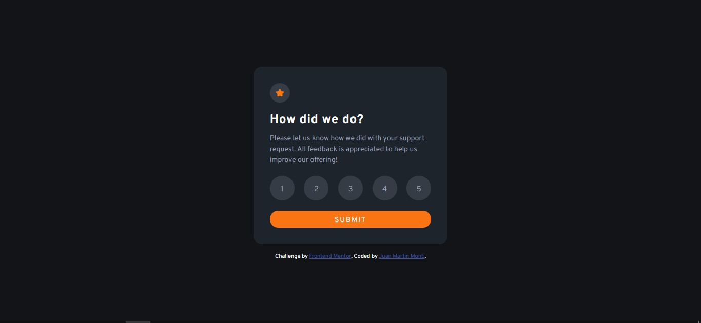
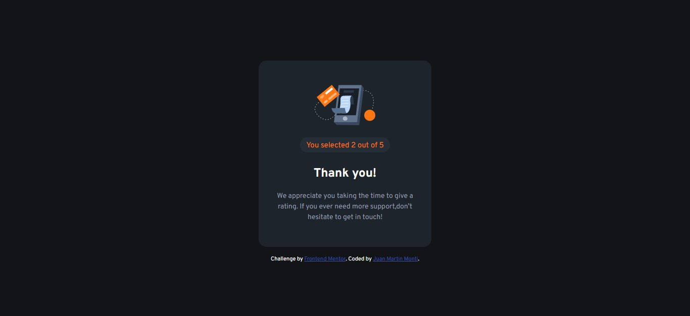

# Frontend Mentor - Interactive rating component solution

This is a solution to the [Interactive rating component challenge on Frontend Mentor](https://www.frontendmentor.io/challenges/interactive-rating-component-koxpeBUmI). Frontend Mentor challenges help you improve your coding skills by building realistic projects.

## Table of contents

- [Overview](#overview)
  - [The challenge](#the-challenge)
  - [Screenshot](#screenshot)
  - [Links](#links)
- [My process](#my-process)
  - [Built with](#built-with)
  - [What I learned](#what-i-learned)
  - [Useful resources](#useful-resources)
- [Author](#author)
- [Acknowledgments](#acknowledgments)

**Note: Delete this note and update the table of contents based on what sections you keep.**

## Overview

### The challenge

Users should be able to:

- View the optimal layout for the app depending on their device's screen size
- See hover states for all interactive elements on the page
- Select and submit a number rating
- See the "Thank you" card state after submitting a rating

### Screenshot




### Links

- Solution URL: [Add solution URL here](https://your-solution-url.com)
- Live Site URL: [Add live site URL here](https://your-live-site-url.com)

## My process

### Built with

- Semantic HTML5 markup
- SCSS custom properties
- Flexbox
- CSS Grid
- Mobile-first workflow
- [Vue.js](https://vuejs.org/) - JS library
- [Styled Components](https://styled-components.com/) - For styles

### What I learned

I learnt how to do projects with a specific structure and good practices. Moreover, I learnt how to use the emits and async components.

To see how you can add code snippets, see below:

```js
const userRate = ref(0);

const TheRateMenu = defineAsyncComponent(() =>
  import("@/common/TheRateMenu.vue")
);

const TheThankYouMenu = defineAsyncComponent(() =>
  import("@/common/TheThankYouMenu.vue")
);

const comp = ref(TheRateMenu);
const handleComp = (rate) => {
  comp.value = TheThankYouMenu;
  userRate.value = rate;
};
```

```js
import { defineEmits, ref } from "vue";
import RateButton from "./BaseButton.vue";
import BaseSubmitButton from "./BaseSubmitButton.vue";

const items = [1, 2, 3, 4, 5];
const number = ref(0);

const defineItem = (param) => (number.value = param);

const emit = defineEmits(["changeComp"]);
const rated = (rate) => {
  emit("changeComp", rate);
};
```

```js
import { defineProps } from "vue";

const props = defineProps({
  rate: {
    type: Number,
    required: true,
    default: 0,
  },
});
```

### Useful resources

- [CURSO DE VUE 3 PROFESIONAL(PROFESSIONAL VUE 3 COURSE) ](https://www.youtube.com/playlist?list=PLDllzmccetSNgykILXnHMeuO-y-gRcF-i) - This is an amazing free course about vue.js separated by chapter with a specific title(is in Spanish).

## Author

- GitHub - [Monti Juan Martin](https://github.com/manialCode)
- Frontend Mentor - [@manialCode](https://www.frontendmentor.io/profile/manialCode)
- Twitter - [@manialcoin](https://www.twitter.com/manialcoin)


## Acknowledgments

If I ever got lost with development, I used to rely on free YouTube courses such as GogoDev, which is where I learned how to use Vue.js.
